# Ren'Py Magic for VSCode

 
 
 A Visual Studio Code extension that adds rich language support for the Ren’Py visual novel engine.

I originally made this for myself after running into a few small annoyances with existing extensions — mainly wanting to jump to labels in current file, check whether an image reference actually exists, and jump to image definitions with `F12`.

I kept adding things as I needed them while working on projects, and over time it just grew into something more complete. It’s still very much shaped by what I personally find useful, but it might be helpful to others too. It's powered by a proper language server (LSP), which makes features like navigation, diagnostics, and completions more consistent and reliable.

## 🚀 Installation

[Install Ren'Py Magic from VSCode Marketplace](https://marketplace.visualstudio.com/items?itemName=adiffx.renpy-language-support)

Or search for "**Ren'Py Magic**" in your Visual Studio Code Extension tab.

## ✨ Features

### 🎨 Syntax Highlighting

* Full highlighting for `.rpy` and `.rpym` files
* Supports:
  * Ren’Py script syntax
  * ATL (Animation and Transformation Language)
  * Embedded Python blocks
* Highlights string interpolation and text tags inside dialogue

### 📖 Hover Documentation

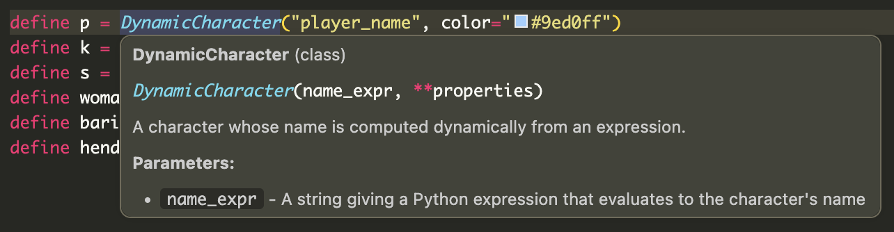

* Hover over keywords, functions, and classes to view inline documentation
* Covers **730+ API entries** sourced from official Ren'Py docs:

| Category             | Examples                             |
| -------------------- | ------------------------------------ |
| `config.*`           | `config.name`, `config.screen_width` |
| `gui.*`              | `gui.text_color`, `gui.show_name`    |
| `build.*`            | `build.name`, `build.directory_name` |
| Actions              | `Jump`, `Call`, `Show`, `Hide`       |
| Style properties     | `background`, `padding`, `color`     |
| Transform properties | `xpos`, `ypos`, `zoom`, `alpha`      |

Also includes:

* Classes and transitions (`Transform`, `Dissolve`, `Fade`, etc.)
* Full support for dotted names (e.g. `config.name`)

#### Image preview

Image preview on hover — hover over `show` or `scene` statements to see a preview of the referenced sprite, scene or CG.

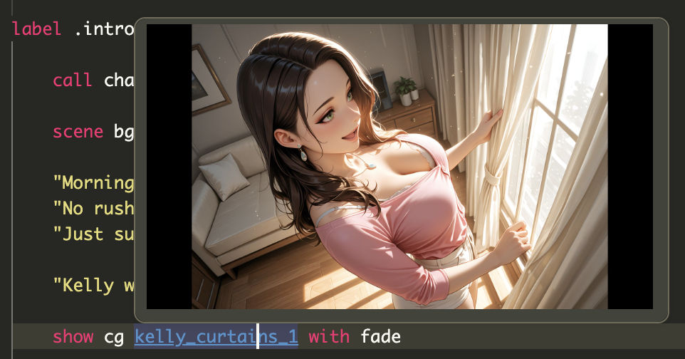

&nbsp;

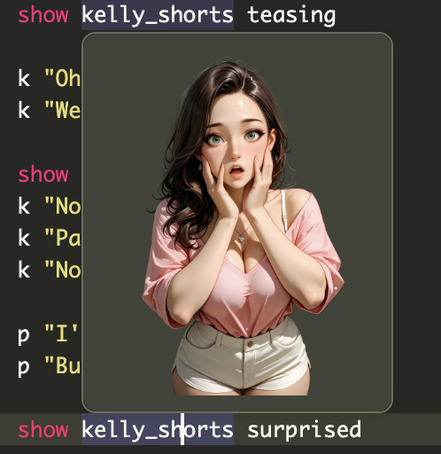

#### Audio & video preview

Hover over `play music|sound|voice|audio <name>` (or `queue ...`) statements, or over the `<name>` part of a `define audio.<name> = "..."` line, to see the resolved file with a play link. Audio opens in VS Code's built-in player; video opens in the OS's default app, since VS Code's viewer can't decode WebM and other Ren'Py-friendly formats.

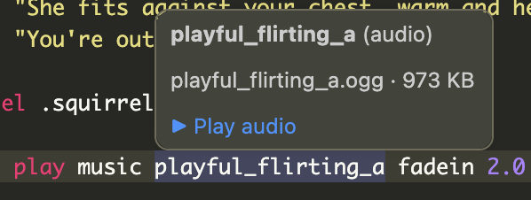

&nbsp;

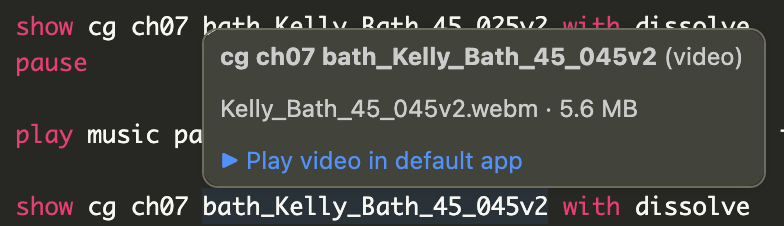

### 🔎 Navigation & Code Intelligence

#### Go to Symbol (`Cmd+Shift+O` / `Ctrl+Shift+O`)

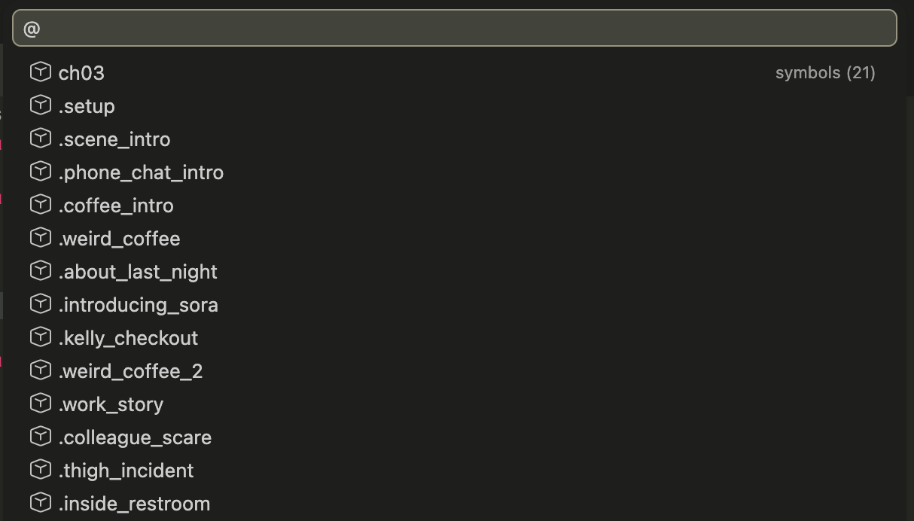

Jump to:

* Labels (including local labels like `.label`)
* Screens
* Transforms
* Images
* Styles, defines, defaults, layeredimages

#### Workspace Symbol Search (`Cmd+T` / `Ctrl+T`)

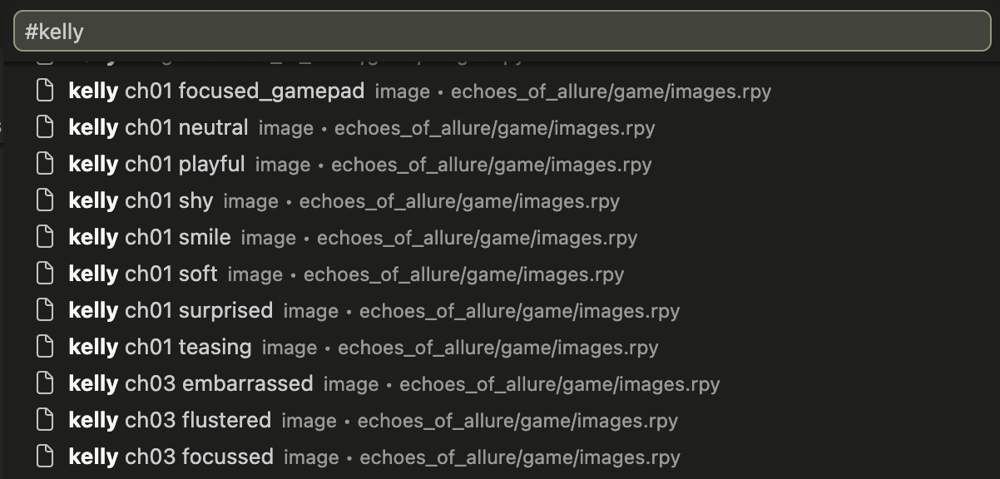

Search across all `.rpy` files:

* Labels, screens, images
* Python functions and classes

#### Go to Definition (`F12`)

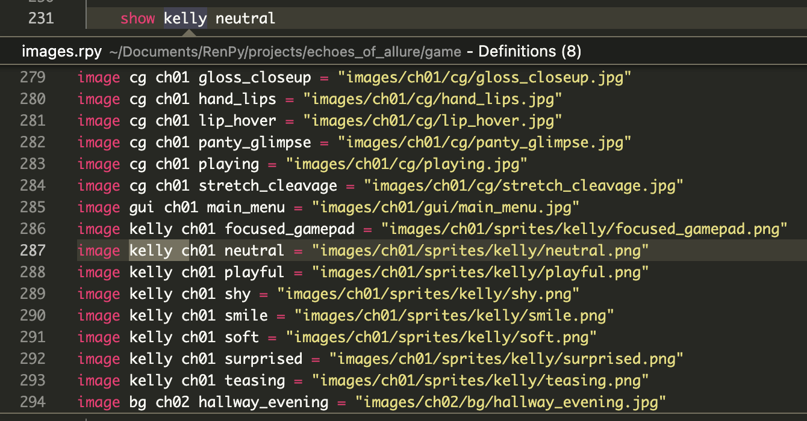

Navigate directly to definitions of:

* Labels (`jump`, `call`)
* Screens (`show screen`, `call screen`, `use`)
* Images (`show`, `scene`, `hide`)
* Transforms and variables

✔ Handles Ren’Py’s flexible image naming (space-separated names)

#### Label Graph

Visualize the control flow of the current file — a click-to-navigate graph of every label plus the `jump`, menu-choice, and implicit fall-through edges connecting them. Useful for eyeballing chapter structure, spotting unreachable labels, and remembering which choices lead where.

Run **Ren'Py: Show Label Graph** from the command palette (or right-click a `.rpy` file). The graph opens in a side tab; drag it to a new window to give it more room.

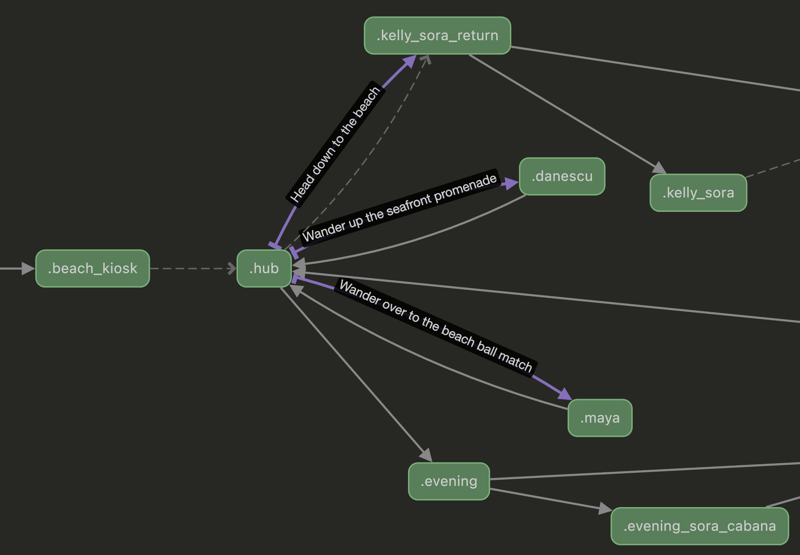

#### Call Hierarchy (`Shift+Alt+H`)

Put the cursor on a `label` definition — or on a `jump`/`call` reference — and open the Call Hierarchy view. See at a glance who calls into that label from anywhere in the workspace, and where it jumps or calls out to. Works for local labels too, scoped to their file.

### 🔁 Refactoring Tools

#### Find All References (`Shift+F12`)

* Locate all usages of labels, screens, images, and variables

#### Rename Symbol (`F2`)

* Rename labels, screens, and variables
* Automatically updates all references across the workspace

### ⚡ Intelligent Completions

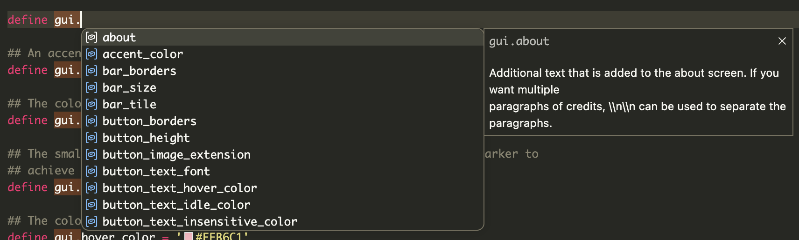

&nbsp;

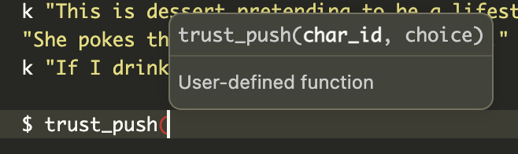

Context-aware suggestions for:

* Ren’Py keywords and statements (eg. `config.`, `gui.`, or `build.`)
* ATL syntax
* Transform and style properties
* Screen properties and `style_prefix` values
* Transitions (after `with`)
* Labels and screens in relevant contexts
* Built-in Ren’Py API
* Image tags and attributes on `show`/`scene`/`hide` (e.g. after `show kelly_casual `, you get `smile`, `teasing`, etc.), plus clause arguments (`at <transform>`, `behind <tag>`, `onlayer <layer>`)
* Audio names defined via `define audio.<name>` after `play`/`queue`/`stop music|sound|voice|audio`

### ✍️ Signature Help

Inline parameter hints for 60+ functions, including:

* Transitions: `Dissolve()`, `Fade()`, `ImageDissolve()`
* Displayables: `Character()`, `Transform()`, `Text()`
* Actions: `Jump()`, `Call()`, `SetVariable()`
* `renpy.*` APIs (`renpy.pause()`, `renpy.show()`, etc.)
* Audio APIs: `renpy.music.*`, `renpy.sound.*`
* Image tools: `im.Composite()`, `LiveComposite()`

### ⚠️ Diagnostics

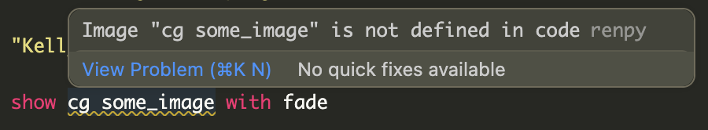

Real-time feedback with:

**Warnings**

* Undefined labels (`jump`, `call`)
* Undefined local labels (`.label`)
* Missing screens (`call screen`, `show screen`, `use`)

**Errors**

* Mismatched quotes (including triple-quoted strings)

## 🛠 Development

```bash
git clone https://github.com/adiffx/renpy-magic.git
cd renpy-magic
npm install
npm run compile
```

Then press `F5` in VS Code to launch the Extension Development Host.

### Running Tests

```bash
npm test
```

### Updating API Data

```bash
npm run fetch-api
npm run compile
```

This pulls documentation from Ren’Py source and RST files, generating:

```
src/server/renpy-api.json
```

## ⚙️ Settings

| Setting | Default | Description |
| ------- | ------- | ----------- |
| `renpyMagic.diagnostics.warnUndefinedImages` | `false` | Warn when `show`/`scene` references an image not defined in code. Disabled by default because images are often defined as files rather than in code. |
| `renpyMagic.renpySdkPath` | `""` | Path to the Ren'Py SDK folder. When set, enables native Ren'Py lint for more accurate error detection. |
| `renpyMagic.lint.enabled` | `false` | Enable native Ren'Py lint integration. Requires `renpySdkPath` to be set. |
| `renpyMagic.lint.onSave` | `true` | Run Ren'Py lint automatically on file save. |

### Native Ren'Py Lint (Optional)

For more accurate error detection, you can enable native Ren'Py lint integration:

1. Download the [Ren'Py SDK](https://www.renpy.org/latest.html)
2. Set `renpyMagic.renpySdkPath` to the SDK folder path (e.g., `/Applications/renpy-8.3.0-sdk`)
3. Enable `renpyMagic.lint.enabled`

When enabled, the extension will run Ren'Py's native lint tool on save, providing errors and warnings from the actual compiler alongside the built-in diagnostics.

## ⚠️ Known Limitations

* Embedded Python does not use a full Python language server
* Image validation only covers code-defined images (enable `warnUndefinedImages` to check)
* Local labels are validated per file (not across files)
* Native lint requires the Ren'Py SDK and may take a few seconds to run on large projects

## 📋 Requirements

* VS Code **1.75.0+**
* (Optional) Ren'Py SDK for native lint integration

## 📄 License

MIT
